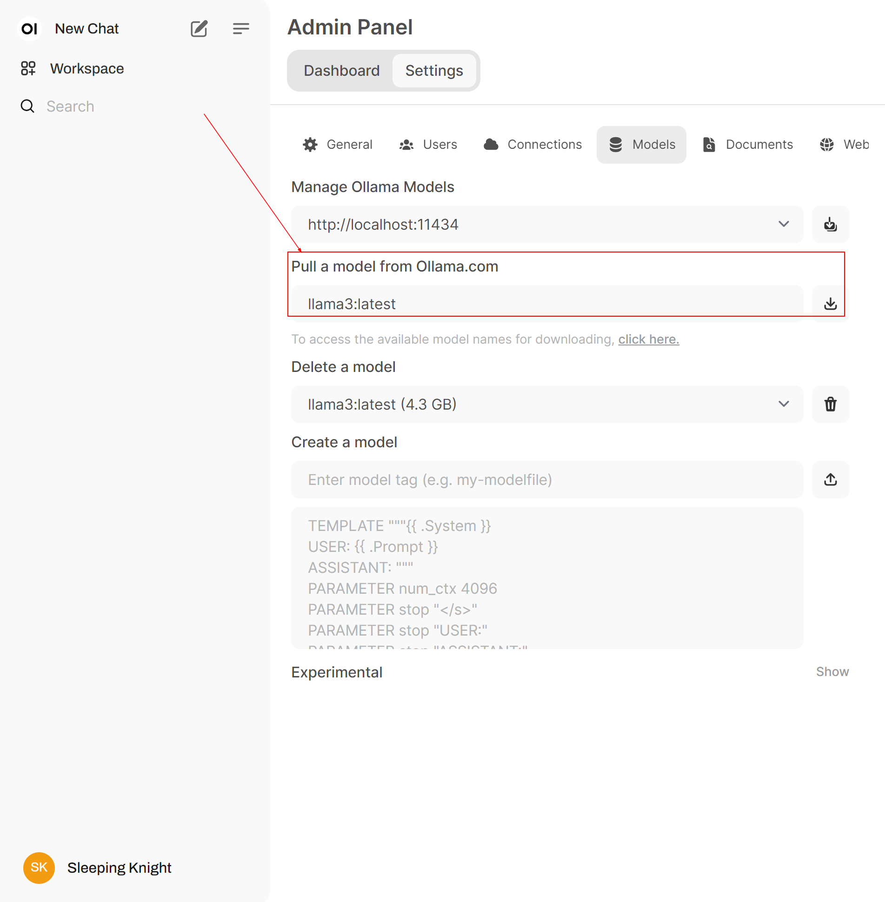
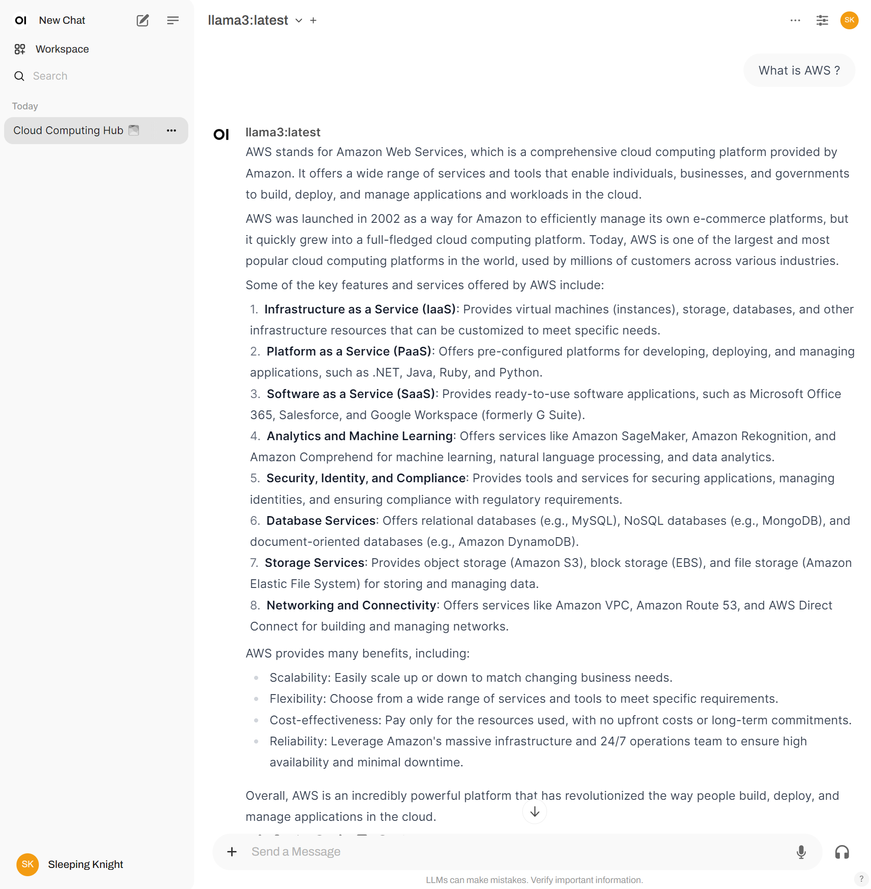

**Step 1:** Install Ollama
```shell
curl -fsSL https://ollama.com/install.sh | sh

# >>> Downloading ollama...
# ######################################################################## 100.0%#=#=#
# ######################################################################## 100.0%
# >>> Installing ollama to /usr/local/bin...
# >>> Creating ollama user...
# >>> Adding ollama user to render group...
# >>> Adding ollama user to video group...
# >>> Adding current user to ollama group...
# >>> Creating ollama systemd service...
# >>> Enabling and starting ollama service...
# Created symlink /etc/systemd/system/default.target.wants/ollama.service → /etc/systemd/system/ollama.service.
# >>> The Ollama API is now available at 127.0.0.1:11434.
# >>> Install complete. Run "ollama" from the command line.
```

**Step 2:** Run Llama3 Model
```shell
ollama run llama3
```

**Step 3 (GPU Support):** Install NVIDIA Driver
```shell
sudo apt install -y nvidia-docker2
sudo systemctl daemon-reload
sudo systemctl restart docker 
```

**Step 4 (GPU Support):** Installing Open WebUI with Bundled Ollama Support
```shell
docker run -d -p 3000:8080 --gpus=all -v ollama:/root/.ollama -v open-webui:/app/backend/data --name open-webui --restart always ghcr.io/open-webui/open-webui:ollama
```

**Step 5 (CPU Only):** Installing Open WebUI with Bundled Ollama Support
```shell
docker run -d -p 3000:8080 -v ollama:/root/.ollama -v open-webui:/app/backend/data --name open-webui --restart always ghcr.io/open-webui/open-webui:ollama
```

**Step 6 (Optional)**: Stop running model without removing (`ollama rm` command)

> **_NOTE:_** https://github.com/ollama/ollama/blob/main/docs/faq.md#how-do-i-keep-a-model-loaded-in-memory-or-make-it-unload-immediately

```shell
# To preload a model and leave it in memory use (Start Model)
curl http://localhost:11434/api/generate -d '{"model": "llama3", "keep_alive": -1}'


# To unload the model and free up memory use (Stop Model)
curl http://localhost:11434/api/generate -d '{"model": "llama3", "keep_alive": 0}'
```

**Step 7:** Sample payload
```shell
curl -X POST http://localhost:11434/api/generate -d '{
  "model": "llama3",
  "input": "Why is the sky blue?"
}'
```

**Step 8:** Pull a Model on the Admin Panel Setting


**Step 9:** Testing Our Model

